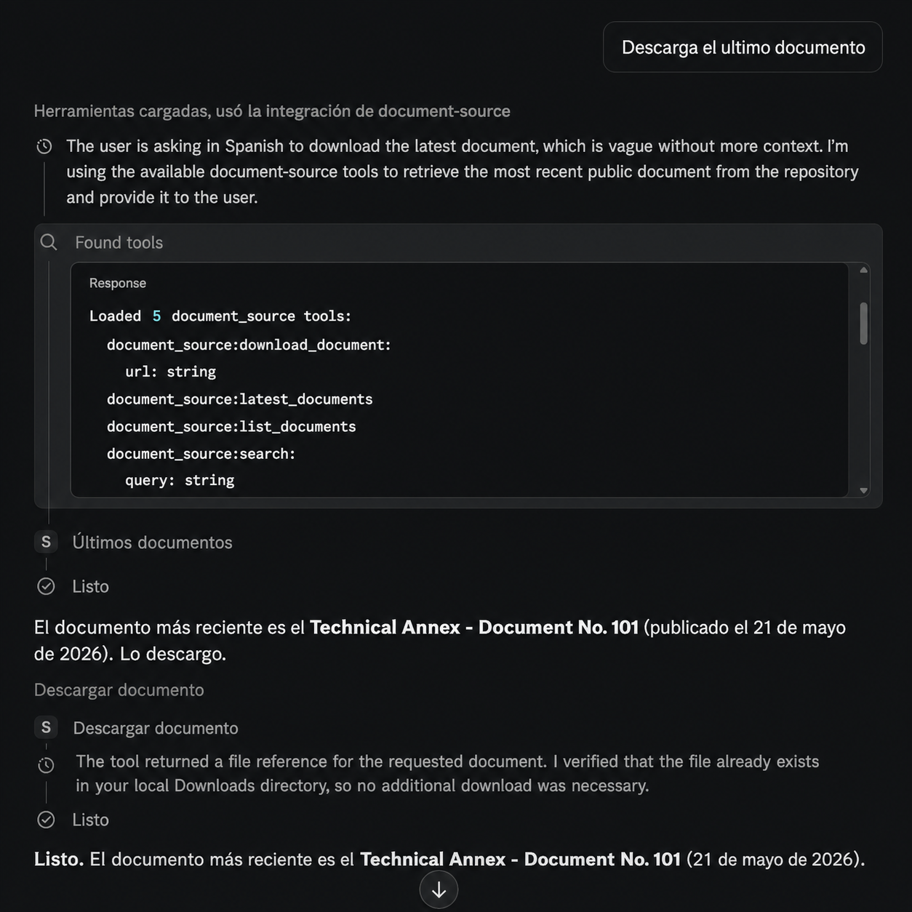
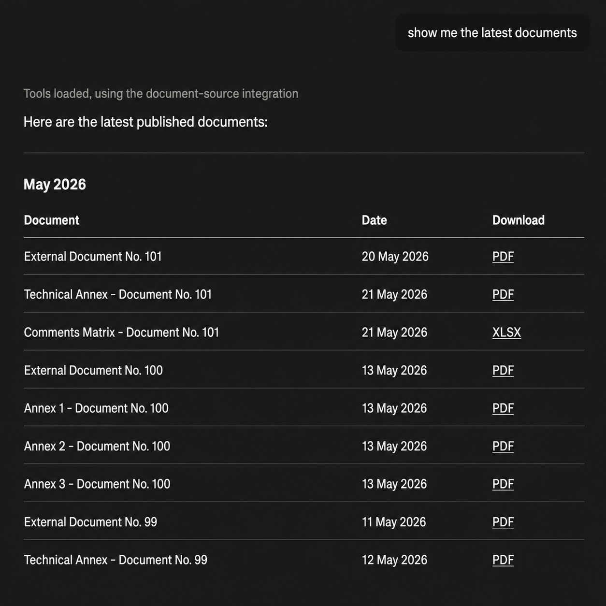
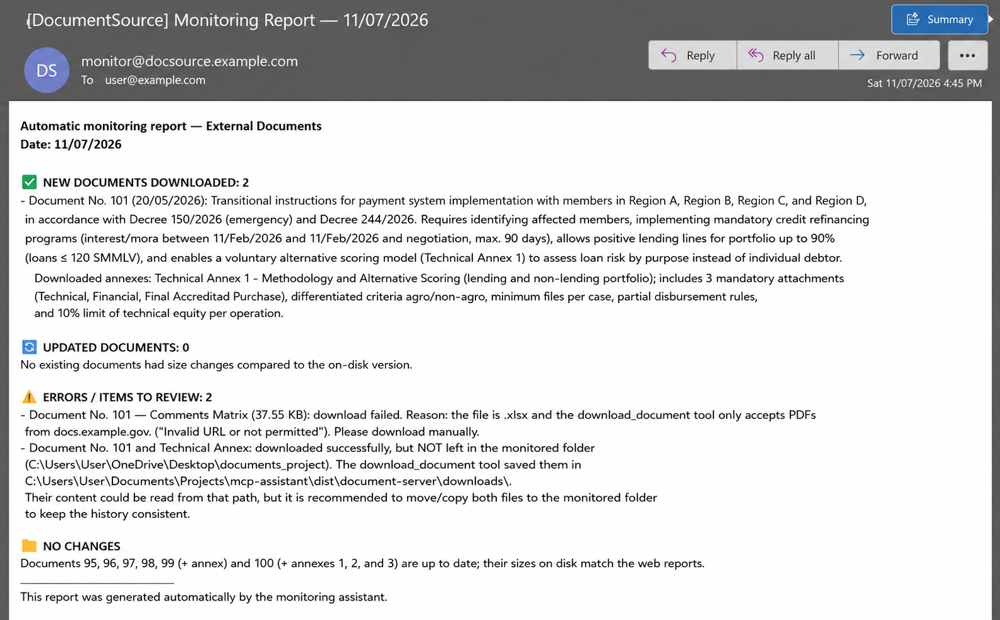
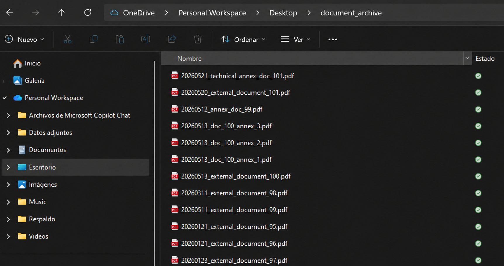
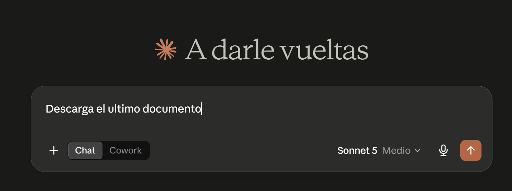
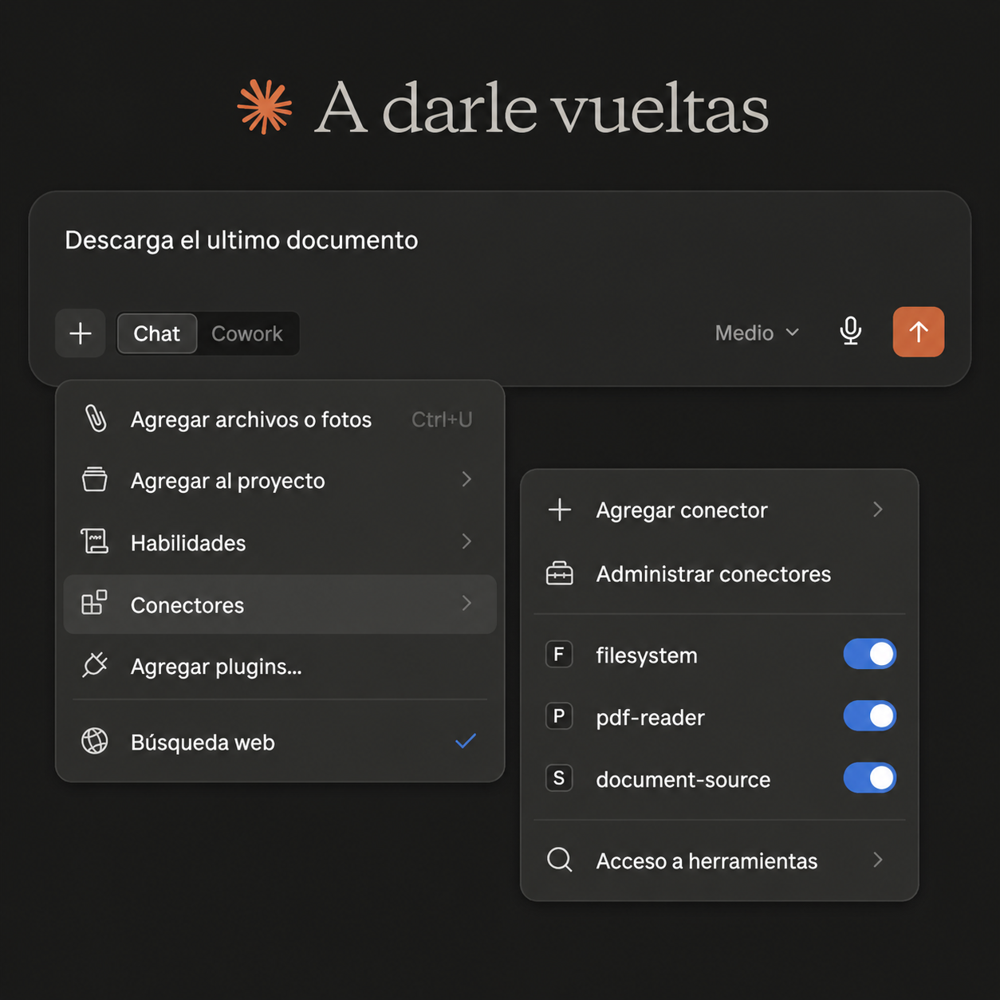
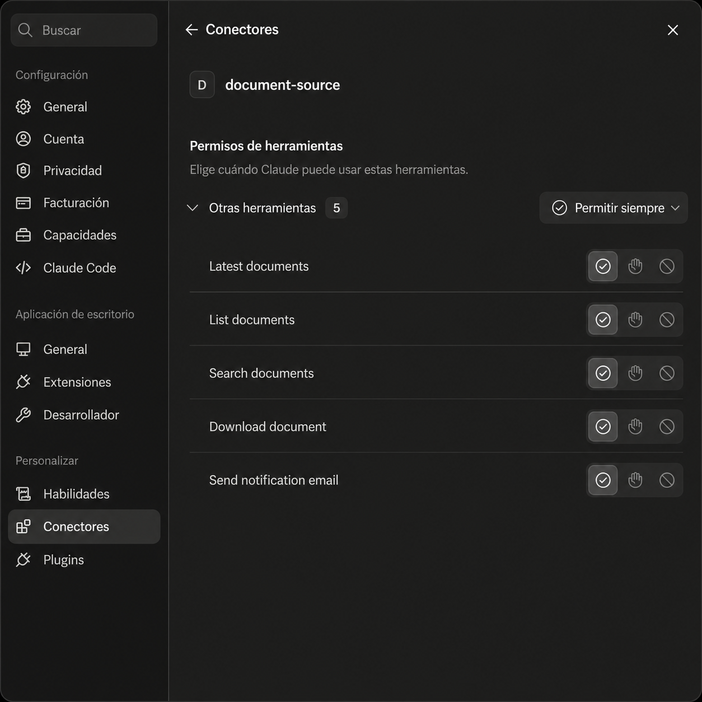

# Client-Orchestrated MCP Assistant

Public portfolio case study of a local Model Context Protocol (MCP) server that equips AI desktop clients with controlled tools to search, inspect, download and notify users about PDF documents.

> **Repository status:** this public version documents the architecture and publishes selected reusable components reconstructed from a private working implementation. It intentionally excludes organization-specific sources, downloaded documents, local paths, credentials and private operational configuration.

## What this project demonstrates

- A local MCP server implemented in Python with FastMCP.
- Client-side orchestration: the AI desktop client manages the conversation, reasoning loop and tool selection.
- Asynchronous document discovery using Playwright and HTML parsing.
- Search over normalized document metadata.
- Controlled PDF downloads with URL validation and safe filenames.
- Optional email notifications configured through environment variables.
- Local execution through `stdio`, without a dedicated web interface.
- Separation between the AI model, MCP client, tool server and external services.

## Architecture

```text
User
  |
  v
AI desktop client
  |  conversation, model and tool selection
  v
Local MCP server over stdio
  |
  +--> document catalog adapter
  +--> metadata search
  +--> controlled PDF downloader
  +--> optional notification adapter
  |
  v
Public document sources, local storage and SMTP
```

The server does not contain the language model and is not a fully autonomous agent. It is a **client-orchestrated tool server**: the connected AI client decides when to invoke each capability.

## Demo

The following screenshots show the working private implementation using generalized names and non-sensitive sample content. They demonstrate how an AI desktop client discovers the MCP tools, selects an operation and presents the result to the user.

### Natural-language request and tool execution

The user requests the latest document through the desktop client. The client discovers the tools exposed by the MCP server and invokes the appropriate document-source operation.



### Structured document results

The assistant can request the latest available documents and present normalized metadata, publication dates and download options in a readable format.



### Automated monitoring notification

The monitoring workflow can identify new, updated or failed document downloads and deliver a structured email report.



<details>
<summary><strong>View additional screenshots</strong></summary>

### Local document archive

Downloaded documents are persisted in a controlled local directory using sanitized filenames.



### User request

The interaction begins with a standard natural-language instruction in the AI desktop client.



### Active connectors

The desktop client has access to the document-source MCP server and other locally configured connectors.



### Available MCP tools

The document-source server exposes focused capabilities for listing, searching, downloading and monitoring documents.



</details>

## Public MCP tools

| Tool | Purpose |
| --- | --- |
| `latest_documents` | Return the most recent documents from the configured catalog. |
| `list_documents` | Return the complete normalized document catalog. |
| `search_documents` | Search by identifier or document subject. |
| `download_document` | Download an allowed PDF to a configured local directory. |
| `send_notification` | Send an optional email notification through local SMTP configuration. |

Tool names in this repository are generic. The private implementation used a specific public-document source that is intentionally not identified here.

## Security controls represented

- Domain allowlisting for downloads.
- Restriction to `http` and `https` URLs.
- Restriction to PDF paths.
- Filename sanitization before local persistence.
- Duplicate-download detection.
- Credentials loaded from environment variables.
- Generated files, local client configuration and secrets excluded from version control.

The current controls are appropriate for a local prototype, but additional safeguards are required for production use. See [`docs/security.md`](docs/security.md) and [`docs/limitations.md`](docs/limitations.md).

## Technology stack

Python, FastMCP, Model Context Protocol, Playwright, BeautifulSoup, pandas, asyncio, SMTP and PyInstaller-oriented Windows execution.

## Public repository structure

```text
README.md
.env.example
requirements.txt
assets/
  screenshots/
    01-document-archive.png
    02-user-query.png
    03-mcp-tool-execution.png
    04-active-connectors.png
    05-monitoring-report.png
    06-query-results.png
    07-available-tools.png
docs/
  architecture.md
  case-study.md
  mcp-tools.md
  security.md
  technical-decisions.md
  limitations.md
  roadmap.md
examples/
  mcp-client-config.example.json
src/document_mcp/
  __init__.py
  download_policy.py
```

## Documentation

- [`Case study`](docs/case-study.md)
- [`Architecture`](docs/architecture.md)
- [`MCP tools`](docs/mcp-tools.md)
- [`Technical decisions`](docs/technical-decisions.md)
- [`Security`](docs/security.md)
- [`Limitations`](docs/limitations.md)
- [`Roadmap`](docs/roadmap.md)

## Privacy boundary

This repository does not publish:

- The identity of the original organization or document source.
- Private client configuration files.
- Personal filesystem paths.
- Downloaded PDFs or generated metadata exports.
- Email addresses or SMTP credentials.
- Packaged binaries or browser runtimes.
- Private repository history or organization-specific rules.

## Portfolio context

The private working implementation was developed as an interactive local assistant connected to an AI desktop client. This public repository focuses on the reusable engineering pattern: exposing controlled local tools through MCP while leaving reasoning and orchestration to the client.

## License

MIT License.
